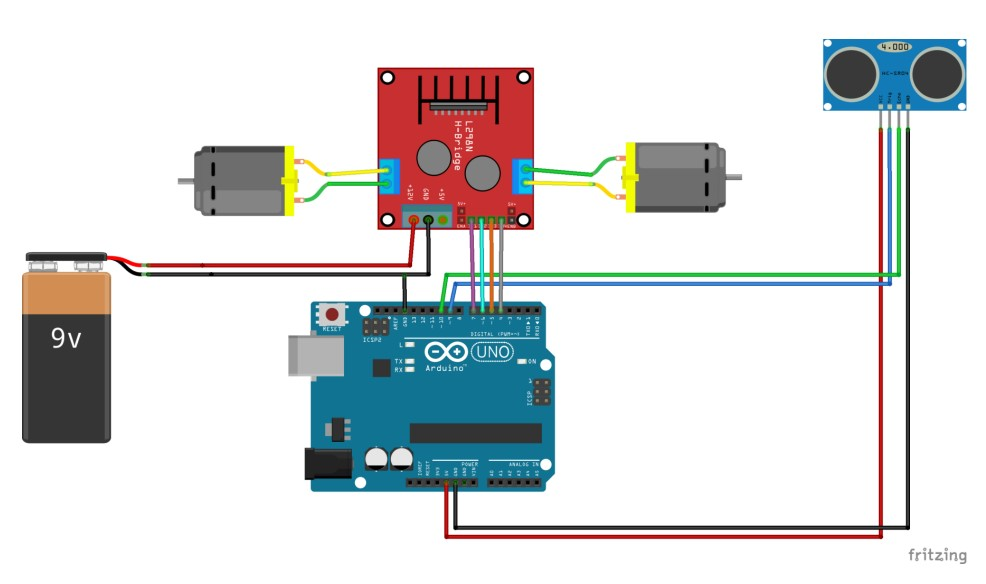
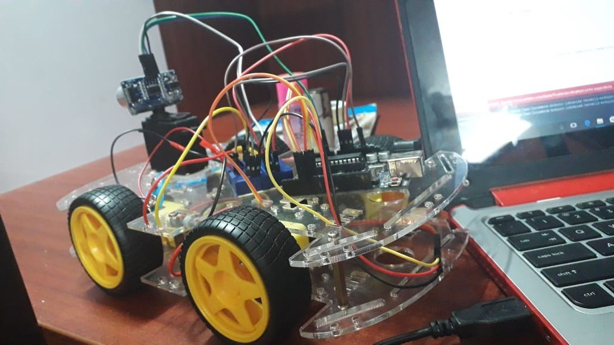
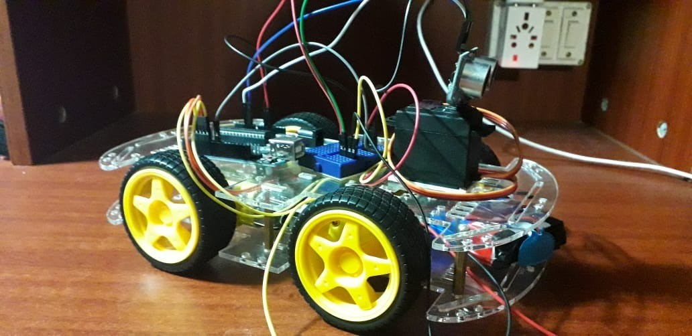
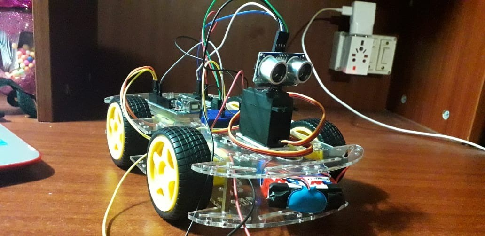

# arduino-obstacleavoidingrover
## An Arduino project for a sonar-based obstacle avoiding rover
This project was completed for college credits for a Sensors and Instrumentation Course.  
The project's goal was to create a semi-autonomous rover that observes it environment using an ultrasonic sensor mounted on a servo and navigates this environment accordingly.

